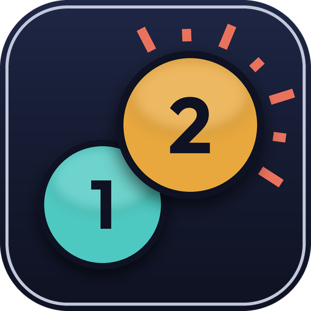

# One Two Punch



A Dalamud plugin that collapses a DPS rotation into **two buttons**.

One button is your single-target rotation. One button is your AoE rotation. Each one shows
the action that is correct *right now* — given your cooldowns, gauge, buffs, combo step,
how many enemies are in range, and whether you are standing still.

**It never presses anything for you.** One keypress is always exactly one action.

---

## Why this exists

This was built for a raid team with physical limitations — people who cannot sustain a
forty-key hotbar through an eight-minute fight, but who want to *play*, not hand the fight
to an automation plugin.

That distinction drives every design decision in here:

| | Automation plugin | One Two Punch |
|---|---|---|
| Who decides *what* | the plugin | the plugin |
| Who decides *when* | the plugin | **you** |
| Inputs sent on your behalf | yes | **never** |
| Works if you stop pressing | yes | no — it does nothing |

The plugin answers a question the game already asks itself many times a second: *"what
should this hotbar slot actually cast?"* That is the same mechanism that turns one button
into the next step of a combo. We answer it with the next correct action instead. Your
icon updates; your finger does the rest.

## What it does for you

- **Two keys instead of thirty.** Single target and AoE.
- **Never clips your global cooldown.** An off-global is only ever suggested when it
  provably fits in the gap — including the animation lock already running.
- **Weave budget you choose.** Two off-globals per GCD, one, or none. "One" costs a little
  damage and a lot of typing.
- **Shows you what's next.** A large, readable panel with the current action *and* the GCD
  after it, so a changing button is something you plan for rather than react to.
- **Doesn't flicker.** A suggestion is held briefly so the icon cannot change under your
  hand mid-reach — and is dropped instantly if it stops being usable.
- **Positional rescue.** If the next hit wants a flank or rear you are not standing in, it
  offers True North instead of asking you to move.
- **Holds burst during downtime**, so raid buffs don't get thrown at an untargetable boss.
- **AoE button falls back to single target** on a lone enemy.

## Install

Add this to Dalamud → Settings → Experimental → Custom Plugin Repositories:

```
https://raw.githubusercontent.com/monkdim/beepboop/main/pluginmaster.json
```

Then find **One Two Punch** in the plugin installer.

### It starts switched off

Installing does not run it. Loading registers two commands and nothing else - no hook, no
reads, no work of any kind - until you type:

```
/otp arm
```

That is on purpose. Installing this plugin has frozen the game on at least one machine and
the cause is not yet understood, so installing it must not be the thing that runs it.
Arming is never saved: restart the game and it is inert again, so there is no way to end
up stuck in a game that will not start. `/otp disarm` stops it and removes the hook
without a restart.

> That listing is generated by CI from the real build. The API level is read off the
> Dalamud assembly itself rather than taken from the packager, which stamps the level it
> was built against — if those disagree, Dalamud hides the plugin with no error, which
> looks exactly like a failed publish. The URL points at the newest release, so it never
> changes. To publish an update, run the **Release** workflow from the Actions tab.

**Not seeing it in the installer?** Almost always an API level mismatch, and it fails
silently — the plugin simply never appears. Dalamud computes its own API level as the
major version of `Dalamud.dll`, and the installer lists a plugin only when the two match
*exactly*. Open the `pluginmaster.json` above in a browser and compare its
`DalamudApiLevel` to your Dalamud's major version. If they differ, re-run the Release
workflow — it derives the level from whatever Dalamud it builds against.

Every merge to `main` republishes automatically, so the listing always describes the
newest build. The **Release** workflow can also be run by hand from the Actions tab.

## Setup

Open `/otp` → **Setup**. It tells you the two actions to put on your hotbar for your
current job. That is the entire setup.

For Dragoon that is **True Thrust** and **Doom Spike**; for Machinist, **Split Shot** and
**Spread Shot**. Their icons change as you play. Everything else on your hotbar is
untouched — the plugin only ever answers for those two slots.

### Commands

| Command | What it does |
|---|---|
| `/otp` (or `/onetwopunch`) | settings |
| `/otp arm` | let it run, this session only — it starts inert |
| `/otp disarm` | stop it and remove the hook |
| `/otp record` | start or stop recording a pull to your Downloads |
| `/otp verify` | check every action id against the game's own data |
| `/otp hud` | toggle the next-action display |
| `/otp on` / `off` | master switch |

## Supported jobs

All thirteen DPS jobs, all four tanks, and Beastmaster — single target and AoE:

| | |
|---|---|
| **Tanks** | Paladin, Warrior, Dark Knight, Gunbreaker |
| **Melee** | Monk, Dragoon, Ninja, Samurai, Reaper, Viper |
| **Physical ranged** | Bard, Machinist, Dancer |
| **Casters** | Black Mage, Summoner, Red Mage, Pictomancer |
| **Limited** | Beastmaster |

The AoE button always shows the AoE rotation, including against a single enemy, so it can
be checked on a striking dummy before it is trusted in a party. The old behaviour - fall
back to single target when only one enemy is in range - is still a toggle in `/otp`.

Melee jobs are told to heal themselves. Second Wind takes the first weave slot going once
your health drops below three quarters, ahead of the rotation; the mark is a slider and the
whole thing is a toggle.

The tanks are the damage rotation only. Mitigation - Sheltron, Rampart, Vengeance, Shadow
Wall, Heart of Corundum, the invulnerabilities, every party cooldown - is deliberately not
in any rule and never will be: when to press those is a judgement about the fight in front
of you, and a button that guessed at it would be worse than no button at all. The ids are
still declared, so the verifier checks them.

Action and status tables are generated from the game's own data, and every id is verified
again at startup.

### Two keys really is all of them

**Ninja** used to need a third. A ninjutsu is two or three mudra presses and then the
cast, which looked like a sequence the main buttons could not express — so it got its own
key. That was wrong, and the game's own data said so: Ten carries cooldown group 58
alongside its own two-charge timer, and group 58 *is* the global cooldown. The mudras are
globals, not weaves. They live on the two main buttons now, and a whole ninjutsu is three
fast presses that add up to about one ordinary global — Raiton on a single target, Katon on
a group, Suiton when Kunai's Bane or Meisui needs it, and the Kassatsu upgrades chosen
automatically.

The Mudra key still exists and still works. It is redundant, and kept only so nobody who
bound it loses it.

Dancer's dances look like the same problem and aren't: its gauge names the next step
outright, so the main buttons walk the dance themselves.

### How honest the rotations are

The engine's guarantees hold on every job — no clipped GCDs, no unusable suggestions, no
wrong ids. The **priority lists** are a different kind of claim: they were written against
the game's data and cross-checked against BossMod and RotationSolver Reborn, but most have
not been parsed on a dummy. Expect them to be good, not optimal, and tell us where they're
wrong. The HUD shows the reason for every choice specifically so a job main can audit it in
one training-dummy pull.

`/otp record` writes that pull to your Downloads: every press, what was suggested beside it, the
reason, the job's gauge, and — for the jobs that have needed it — a readiness line saying
what the engine believed it was *allowed* to suggest, with the game's own refusal code when
it was not. That last part exists because a rule that never fires leaves no other trace: a
log can show a full gauge, an open weave window and the right buffs, and still not say that
the action was reported locked, uncharged, or refused. Four rounds of a Ninja bug went by
before it did.

**Openers** are transcribed from [The Balance](https://www.thebalanceffxiv.com/)'s opener
charts — Dragoon, Monk, Reaper, Samurai, Viper, Bard, Machinist, Black Mage, Pictomancer
and Red Mage. Each one is pinned by a test that restates the chart independently, so a
transcription slip fails CI rather than a pull. An opener *overrides* the priority list
while it runs, so it gives up the moment reality stops matching, and never starts
mid-fight.

Ninja, Dancer and Beastmaster have none, on purpose. Ninja's chart leaves the mudra
presses implicit, and a scripted list would have to invent them — a wrong one is a Rabbit
Medium, a wasted global. Dancer's chart is half contextual: the dance steps are randomised
per dance and four of its globals are drawn as "Priority GCD" placeholders. Nobody has
published a Beastmaster opener at all. None of the three is a fixed sequence, so none gets
guessed at; their priority lists open on their own.

### What is deliberately left to you

Two things are in the kit, understood, and still not driven — because nothing the game
exposes can drive them correctly, and a wrong guess costs a global:

- **Ninja's Ten Chi Jin.** The cooldown itself is suggested, inside the burst window where
  it belongs. Its three presses are not: inside that buff every unspent slot is legal, so
  priority order is the entire decision and the list can only ever name one of them. The
  status carries no stack count and the three ids have no indirection entry, so there is no
  state to walk. Press your own Ten, Chi and Jin for those six seconds.
- **Beastmaster's familiar cycle.** Borrow grants one of eight Kinships and morphs Beast
  Mode into a different action for each; the Battlehorns summon and the cooldown does not
  start until the familiar retreats. That is a real rotation and it will get rules, but not
  before a recorded pull shows one.

Both are reported in the log rather than driven, which is the honest half of the same
decision.

## How it's built

```
src/OneTwoPunch.Core/     the rotation engine - plain C#, no Dalamud, fully unit tested
src/OneTwoPunch.Plugin/   the Dalamud layer - hooks, game state, UI
tests/                  the tests that actually verify the rotations
```

The engine deliberately has **no dependency on Dalamud or the game**, so rotation logic is
tested in CI on every push. See [docs/DESIGN.md](docs/DESIGN.md).

## Accuracy of the action tables

Hard-coded action ids are the most fragile thing in a plugin like this: patches shuffle
them and a wrong one is invisible until it casts the wrong ability in a raid.

So they are treated as a guess. Every id is checked against the game's own Action and
Status sheets at startup and **repaired by name** if it does not match. A job whose names
cannot be resolved at all is **switched off with a message** rather than run on hope. Run
`/otp verify` after a patch to see the state of every id.

## A note on third-party plugins

Third-party plugins are not supported by Square Enix and using them is against the FFXIV
terms of service. This one sends no input, automates nothing, and reads only what the game
already puts on your screen — but that does not change the terms. Your call to make.

## Credits

Action and status ids are generated from [BossMod](https://github.com/awgil/ffxiv_bossmod)'s
`ActionQueue` definitions (BSD 3-Clause), which are regenerated from the game's own data each
patch. Only the id, name, level and global-cooldown facts are taken; the rotation engine and
priority lists here are this project's own. Regenerate with:

```
python3 tools/generate_action_tables.py /path/to/ffxiv_bossmod
```

That transcription is not trusted blindly either — every id is still verified against the
game's own sheets at startup, which is how four wrong Dragoon values were caught.

## Licence

MIT.
